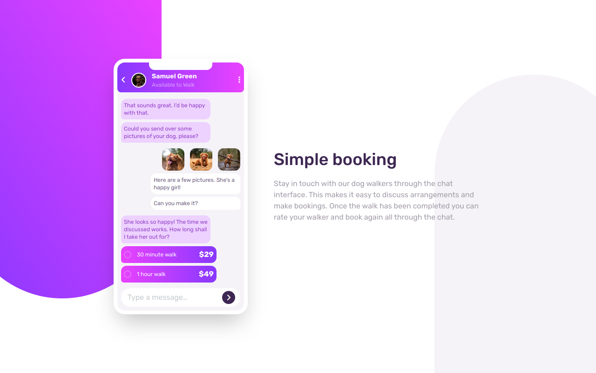

# Frontend Mentor - Chat app CSS illustration solution

This is a solution to the [Chat app CSS illustration challenge on Frontend Mentor](https://www.frontendmentor.io/challenges/chat-app-css-illustration-O5auMkFqY). Frontend Mentor challenges help you improve your coding skills by building realistic projects.

## Table of contents

- [Overview](#overview)
  - [The challenge](#the-challenge)
  - [Screenshot](#screenshot)
  - [Links](#links)
- [My process](#my-process)
  - [Built with](#built-with)
- [Author](#author)

## Overview

### The challenge

Users should be able to:

- View the optimal layout for the component depending on their device's screen size
- **Bonus**: See the chat interface animate on the initial load

### Screenshot

### Links

- Solution URL: [View Solution](https://www.frontendmentor.io/solutions/chat-app-css-illustration-SwasDtk4oi)
- Live Site URL: [View live site](https://chat-illustration-app.vercel.app/)

## My process

### Built with

- Semantic HTML5 markup
- CSS custom properties
- Flexbox
- Mobile-first workflow
- [React](https://reactjs.org/) - JS library
- [Tailwind](https://tailwindcss.com/) - Css framework

## Author

- Website - [Adetoye](https://adetoye.vercel.app)
- Frontend Mentor - [@adetoye-dev](https://www.frontendmentor.io/profile/adetoye-dev)
- Twitter - [@adetoye_dev](https://www.twitter.com/adetoye_dev)
